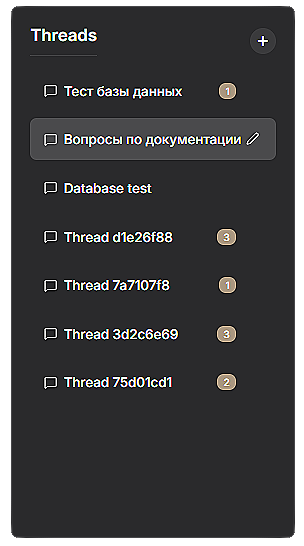

# RAG AI-приложение (RAGgie BOY)

Это проект простого RAG-приложения (Retrieval-Augmented Generation), которое использует локальные LLM-серверы, ChromaDB для векторного хранения, бэкенд на FastAPI и пользовательский интерфейс на React.

## Основные компоненты

Приложение разделено на бэкенд на Python, отвечающий за логику ИИ, и фронтенд на React для взаимодействия с пользователем.

### Бэкенд (`app/`)

-   **`main.py`**: Сервер FastAPI, предоставляющий эндпоинты для загрузки документов, управления чат-тредами, настройками и взаимодействия с AI-агентом.
-   **`agent.py`**: Содержит класс `Agent`, который управляет определением намерений пользователя, извлечением документов и логикой генерации ответов.
-   **`chroma_client.py`**: Клиент для ChromaDB, который управляет двумя коллекциями: одна для текстовых чанков (`rag_collection`), а другая для метаданных документов (`documents_metadata`). Он также обрабатывает загрузку файлов, включая извлечение текста и его разделение на чанки.
-   **`embedding_client.py`**: Клиент для генерации текстовых эмбеддингов с использованием локального сервера эмбеддинг-модели.
-   **`generator.py`**: Клиент для генерации текстовых ответов от локального сервера чат-модели с поддержкой нескольких бэкендов (Qwen, Llama, OpenAI).
-   **`thread_store.py`**: Управляет тредами бесед, сохраняя и извлекая их из локальной файловой системы.
-   **`schemas.py`**: Определяет модели Pydantic, используемые для валидации и структурирования данных во всем бэкенде.
-   **`server_launcher.py`**: Управляет запуском и остановкой локальных серверов моделей с поддержкой конфигураций и мониторинга статуса.
-   **`controllers/`**: Каталог с контроллерами для различных функций: `server_controller.py`, `document_controller.py`, `thread_controller.py`, `settings_controller.py`, `util_controller.py`.
-   **`mcp/`**: Модуль для управления конфигурациями и другими вспомогательными функциями.

### Фронтенд (`front-react-v/`)

-   Приложение на React, созданное с помощью Vite.
-   Использует стандартные React компоненты и CSS для стилизации.
-   Имеет интерфейс с вкладками для "Чата", "Документов", "Тредов" и "Настроек".
-   Включает функциональность загрузки документов, управления тредами и настройками.

## Как это работает

1.  **Загрузка документов**: Пользователи могут загружать документы через пользовательский интерфейс. Бэкенд сохраняет файл, извлекает из него текст, разбивает его на чанки, генерирует эмбеддинги для каждого чанка и сохраняет их в ChromaDB. Метаданные документа хранятся в отдельной коллекции.
2.  **Взаимодействие в чате**: Когда пользователь отправляет сообщение, `Agent` сначала определяет намерение пользователя и необходимость извлечения информации.
3.  **Извлечение**: Если извлечение необходимо, `Agent` использует `ChromaClient` для поиска релевантных текстовых чанков из проиндексированных документов.
4.  **Генерация**: Извлеченные чанки и история беседы передаются в `Generator`, который использует локальный LLM для генерации ответа.
5.  **Управление беседой**: `ThreadStore` отслеживает историю беседы для каждой сессии чата.

## Запуск приложения

Для запуска этого приложения необходимо запустить локальные серверы моделей, бэкенд FastAPI и фронтенд React.

### 1. Подготовка

Скопируйте `.env.example` в `.env` и настройте параметры:

```shell
cp .env.example .env
```

При необходимости измените параметры в `.env` файле.

### 2. Запуск серверов моделей

По умолчанию, серверы для чат-модели и эмбеддинг-модели запускаются автоматически вместе с бэкенд-сервером FastAPI. Конфигурации для запуска находятся в папке `app/launch_configs`.

Если вы хотите запустить бэкенд без автоматического запуска серверов моделей, установите переменную окружения `START_SERVERS` в `false`:

```shell
START_SERVERS=false python -m uvicorn app.main:app --reload --host 0.0.0.0 --port 8080
```

Вы также можете запустить серверы моделей вручную. Вам понадобятся два отдельных экземпляра `llama-server`: один для чат-модели и один для эмбеддинг-модели.

**Запуск чат-модели (пример):**
```shell
llama-server.exe --model models/gemma-3n-E2B-it-Q4_K_S.gguf --n_gpu_layers 999 --port 11434 --ctx-size 12000
```

**Запуск эмбеддинг-модели (пример):**
```shell
llama-server --port 11435 --model models/embeddinggemma-300m-qat-Q8_0.gguf --embedding -c 2048 -b 2048 -ub 1024
```
*Примечание: При необходимости измените пути к моделям и параметры.*

### 3. Запуск бэкенд-сервера

Перейдите в корневой каталог проекта и запустите приложение FastAPI с помощью `uvicorn`.

```shell
python -m uvicorn app.main:app --reload --host 0.0.0.0 --port 8000 
```
Бэкенд будет доступен по адресу `http://127.0.0.1:8000`.

### 4. Запуск фронтенд-интерфейса

В отдельном терминале перейдите в каталог `front-react-v`, установите зависимости и запустите сервер разработки Vite.

```shell
cd front-react-v
npm install
npm run dev
```
Пользовательский интерфейс будет доступен по адресу `http://localhost:5173` (или другому порту, если 5173 занят).

## Интерфейс приложения

Приложение имеет интуитивно понятный интерфейс с разделением на несколько вкладок:

### Вкладка Чат


Вкладка чата позволяет вести диалог с AI-ассистентом, используя загруженные документы в качестве контекста.

### Вкладка Документы


Вкладка документов позволяет загружать, просматривать и управлять документами, которые будут использоваться для RAG.

### Вкладка Тредов


Вкладка тредов позволяет управлять историей чатов и переключаться между различными сессиями.

### Интеграция с базой данных


Приложение также поддерживает интеграцию с SQL-базами данных для расширенных возможностей поиска и извлечения информации.

## Структура проекта

```
.
├── app/                    # Бэкенд на Python
│   ├── agent.py           # AI агент
│   ├── chroma_client.py   # Клиент ChromaDB
│   ├── embedding_client.py # Клиент эмбеддингов
│   ├── generator.py       # Клиент генерации (Qwen, Llama, OpenAI)
│   ├── main.py           # Основной сервер FastAPI
│   ├── server_launcher.py # Запуск серверов моделей
│   ├── controllers/       # Контроллеры API
│   └── mcp/              # Вспомогательные модули
├── front-react-v/         # Фронтенд на React
│   ├── src/              # Исходный код React
│   └── package.json      # Зависимости и скрипты
├── models/               # Модели для llama-server
├── storage/              # Хранилище документов и векторов
├── images/               # Скриншоты интерфейса
└── .env.example          # Пример файла конфигурации
```


---
# ЗАЯВКА

**Название проекта:**
___ AI

**Опишите какую проблему решает ваш стартап (50 знаков или меньше):**
- Конфиденциальность данных при работе с AI-ассистентами.

**Цель вашего проекта?**
- Создать локальное RAG AI-приложение, которое позволяет бизнесу и индивидуальным пользователям безопасно работать с документами и базами знаний без отправки данных в облако, обеспечивая полный контроль и конфиденциальность.

**Почему вы решили работать над этой идеей? Есть ли у вас экспертные знания в этой области?**
- Мы видим растущую потребность в безопасных AI-решениях. Облачные LLM-сервисы не подходят для работы с конфиденциальной информацией. У нас есть опыт в разработке ПО, работе с machine learning моделями и управлении данными, что позволяет нам создать эффективный и надежный продукт.

**Есть ли у вас конкуренты? Что знаете вы, чего не знают или не умеют ваши конкуренты?**
- Основными конкурентами являются облачные AI-сервисы (ChatGPT, YandexGPT). Однако они требуют отправки данных на внешние серверы. Наше ключевое преимущество — полная локализация. Проект использует open-source технологии `llama.cpp` и `chroma DB`, что обеспечивает работу на собственном оборудовании. Это гарантирует максимальную безопасность и отсутствие зависимости от сторонних провайдеров.

**Какую пользу ваш проект может принести гражданам Беларуси?**
- Проект предоставит белорусским компаниям, особенно в финансовой, юридической и промышленной сферах, инструмент для внедрения AI без рисков утечки коммерческой тайны. Это повысит их конкурентоспособность. Также это стимулирует развитие локальных AI-компетенций и создаст основу для новых технологических продуктов в стране.

**На каком этапе вы находитесь и что вы планируете делать в ближайшее время?**
- Разработан прототип, который позволяет индексировать и выполнять запросы к локальной базе документов. В ближайшие 3 месяца мы планируем улучшить пользовательский интерфейс, расширить поддержку форматов документов и внедрить агентные функции.

**Нужны ли инвестиции на данном этапе? Если да, то в каком объёме (ориентировочная сумма) и на что они будут направлены?**
- Да. Они будут направлены на покупку оборудования для запуска локальных ИИ-моделей. (XXX$)

**Каковы сроки реализации проекта? Каковы сроки разработки первого MVP?**
- MVP уже готов. Публичный релиз с базовым функционалом планируется через 4 месяца. Версия с расширенными возможностями для корпоративных клиентов будет готова через 9-12 месяцев.

**Как вы зарабатываете/ собираетесь зарабатывать? Вы потенциально можете заработать?**
- ХЗ